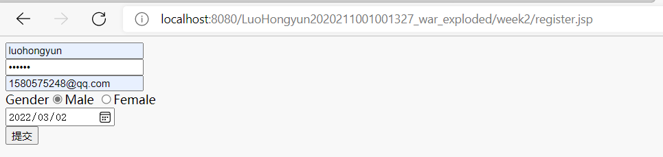
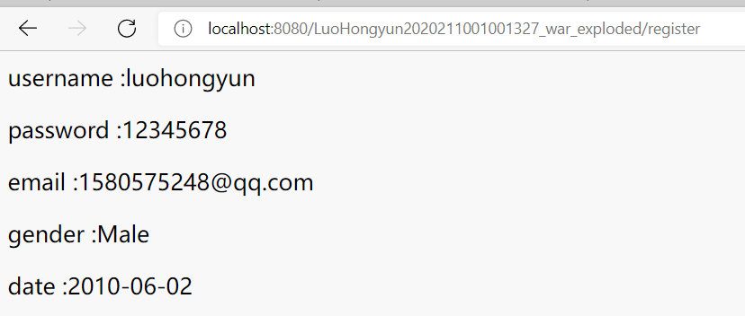
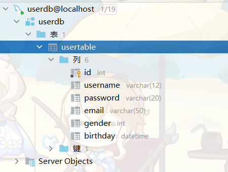

jsp week2

ID:2020211001001327

Name:LuoHongyun

## week2:Result:

## week3:Result:

## week4:Result:

## week5:Result:
- MyJsp.jsp:

- register.jsp

- index.jsp

login:

## week6:Result

- ERROR:
  
- SUCCESS
  

## week7:Result

## week8:Result

RememberMe

userinfo--ToUpdate

updateUser.jsp

update

datebase:

# week9 Result
- demo1

- demo2

- demo3

